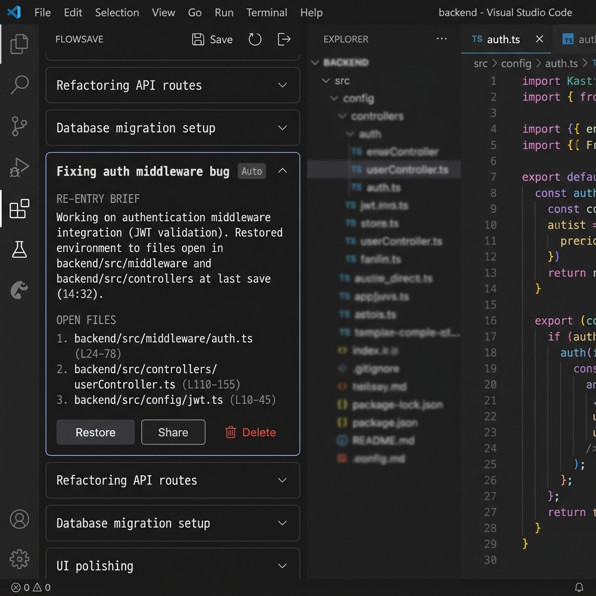
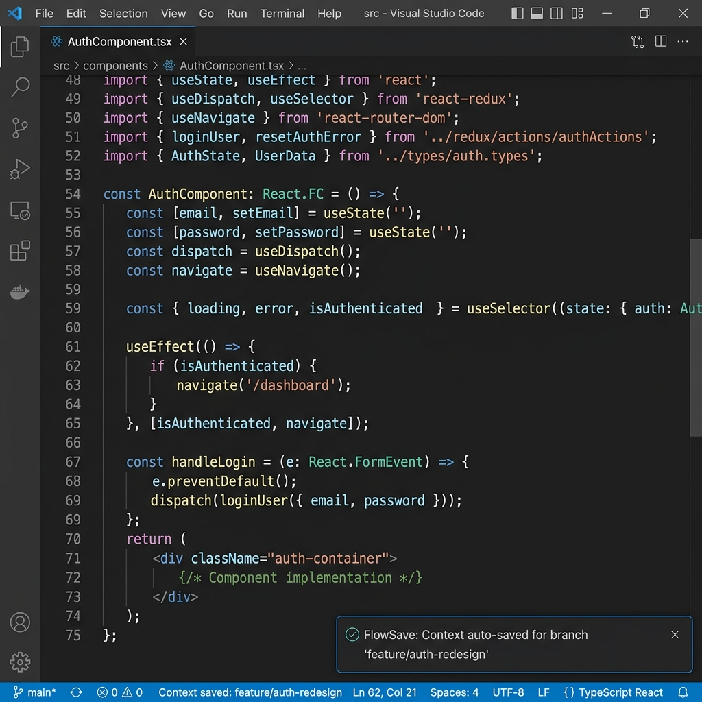
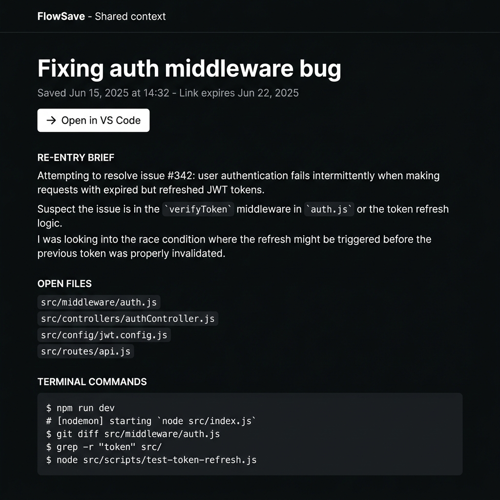
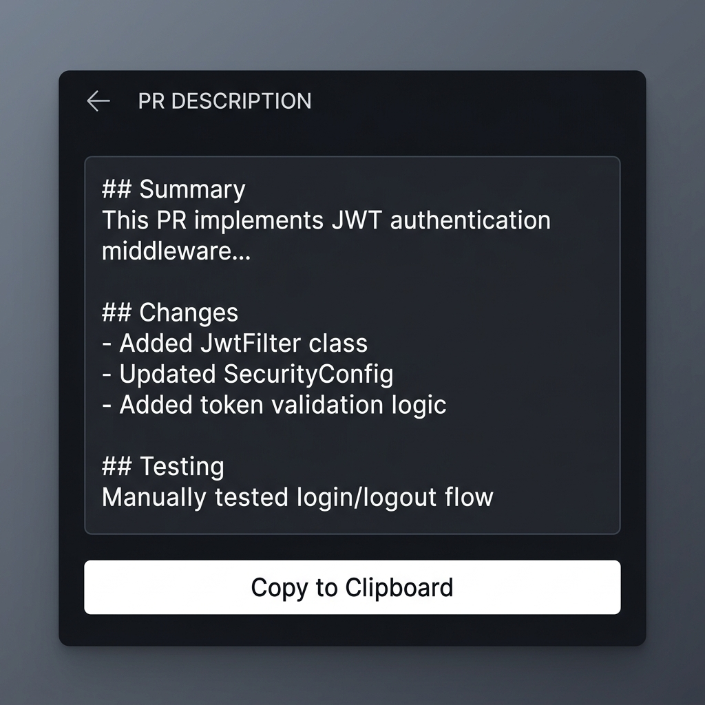

# FlowSave

**Save your flow. Restore your focus.**

FlowSave captures your entire working context — open files, cursor positions, git diff, and terminal history — then uses AI to write a concise re-entry brief so you know exactly where you left off when you return.

No more spending 10 minutes trying to remember what you were doing.

---

## How it works

When you need to switch tasks, FlowSave snapshots:
- Every file you had open and which line your cursor was on
- Your current git diff (uncommitted changes)
- Your recent terminal commands
- An AI-generated summary of what you were doing and what to do next

When you come back, one click reopens all your files at the exact cursor positions and shows you the re-entry brief.

---

## Sidebar



Each saved context shows:
- The label you gave it (or an auto-generated one for branch switches)
- A concise AI re-entry brief — what you were doing, what files mattered, what to do next
- Every open file with its exact line number
- Restore, Share, and Delete actions

---

## Features

### Save Context

Press `Cmd+Shift+P` → **FlowSave: Save Context**, enter a short label (or press Enter to skip), and your context is saved with an AI-generated brief.

### Restore Context

Click any card in the sidebar and hit **Restore**. All your files reopen at the exact cursor positions.

### Auto-Save on Branch Switch



When you switch git branches, FlowSave automatically saves your context in the background. When you switch back to a branch that has a saved context, you'll be prompted to restore it. No manual action needed.

### Share Context with Your Team

Click **Share** on any context card to get a public link. Anyone with the link can:
- Read the full context in their browser — including the re-entry brief, open files, and terminal commands
- Click **Open in VS Code** to open all the files in their own editor at the saved positions (requires the same project folder)



Share links are valid for 7 days.

### Export as PR Description

Click **Export PR** on any context card. FlowSave uses AI to generate a structured pull request description based on your context — what changed, why, and how to test it.



Copy it directly into GitHub, GitLab, or Bitbucket.

---

## Getting Started

1. Install FlowSave from the Marketplace
2. Click the bookmark icon in the VS Code Activity Bar
3. Create an account with your email and password
4. Open any project and use `Cmd+Shift+P` → **FlowSave: Save Context**

Your contexts are stored securely in the cloud and synced across devices.

---

## Terminal Command Tracking

To capture terminal commands, add this one-time hook to your shell:

**Zsh (macOS default)** — add to `~/.zshrc`:
```bash
preexec() {
  echo "$1" >> /tmp/flowsave_history.txt
  tail -50 /tmp/flowsave_history.txt > /tmp/flowsave_history_tmp.txt && mv /tmp/flowsave_history_tmp.txt /tmp/flowsave_history.txt
}
```

Then run `source ~/.zshrc`.

---

## Commands

| Command | Description |
|---|---|
| FlowSave: Save Context | Capture current context and save it |
| FlowSave: Restore Context | Open the sidebar to browse and restore |
| FlowSave: Show Saved Contexts | Open the sidebar |

---

## Requirements

- VS Code 1.85 or later
- An internet connection (contexts are stored in the cloud)

---

## Privacy

Your contexts (file paths, git diffs, terminal commands) are stored encrypted on a secure backend and are only accessible with your account credentials. Share links are the only way to make a context public, and they expire after 7 days.

---

## License

MIT — [GitHub Repository](https://github.com/AtharvChanana/FlowSave)
